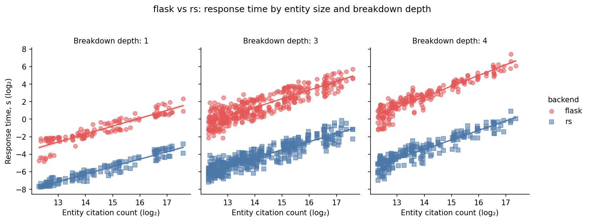
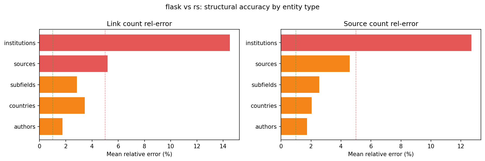
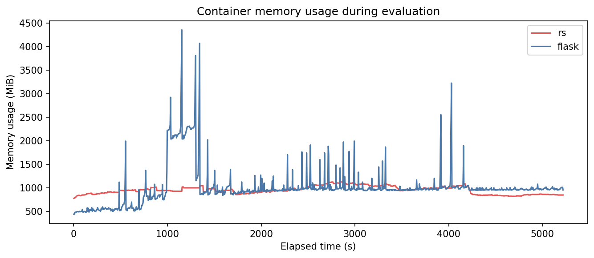

# Comparisons & Benchmarking

How to run tree queries at scale against one or more server instances for correctness and
performance, plus the recorded SQL-vs-Rust results.

Part 1 — [Running comparisons & benchmarks](#running-comparisons--benchmarks)
Part 2 — [SQL vs Rust results](#sql-vs-rust-results)

---

## Running comparisons & benchmarks

All benchmark/comparison tooling runs through one entry point — `uv run -m pyscripts
<command>` (see `uv run -m pyscripts -h`). Each command's module is imported lazily, so a
missing/broken dependency in one (e.g. `bench` needs `psutil`) never breaks the others.

| Command          | Module                           | Purpose                                                                                                                                                                     |
| ---------------- | -------------------------------- | --------------------------------------------------------------------------------------------------------------------------------------------------------------------------- |
| `compare-branch` | `pyscripts/branch_comparison.py` | Perf comparison of two git refs (worktree-isolated) — `tlog` phase timing + cgroup peak memory, with a structural-diff correctness guard. See `perf-benchmark-framework.md` |
| `compare-sql`    | `pyscripts/sql_comparison.py`    | Flask/PostgreSQL vs Rust — structural diff, Pearson, relative error                                                                                                         |
| `bench`          | `pyscripts/bm.py`                | Local throughput + memory benchmark; auto-compares current branch vs `rankless-main`                                                                                        |
| `cache <action>` | `pyscripts/cache_prompting.py`   | Warm/validate the server response cache (`prep`/`read`/`rest`/`validate-*`)                                                                                                 |

`compare-sql` is thin: it defines only its backend pair and a `fetch_pair` callback over the
shared three-stage skeleton — rebuild dispatch, the sample → query → diff loop, and the
artifact/report tail — in `pyscripts/comparison_driver.py`, emitting the correctness-oriented
artifact set via `pyscripts/comparison_report.py`. `compare-branch` is a separate perf driver
(`branch_comparison.py` + `perf_report.py`): it reuses `sample_entities`, `setup_logging`, and
`tree_diff` but runs refs sequentially with `tlog`-timer + cgroup-memory capture instead of the
simultaneous `fetch_pair` loop.

### Shared infrastructure

**`comparison_driver.py`** — orchestration shared by both comparison modes:
`prepare_backend(level, server, stow=, stash_label=)` (rebuild dispatch),
`sample_entities(df, bins, e_per_bin)` (stratified sample), `run_query_loop(sample_df, specs,
fetch_pair, bd_filter=)` (yields `CompResult`s), `write_artifacts(...)` (CSVs + plots +
report, with `poster=`/`save_mem_csv=` toggles).

**`comparison_report.py`** — analysis + reporting used by both modes; `open_report(html_path)`
opens the result in Firefox (silently ignored if unavailable).

- `CompResult` — `time_a`, `time_b`, `diff_df` (always `"a_"`/`"b_"`-prefixed columns)
- `setup_logging(log_path)` — DEBUG file + INFO console handler on `rankless.comparison`
- `build_summary_df` (per-query: Pearson, rel-error, missing nodes),
  `build_grouped_df` (by `root_type × bd_label`, `time_rate = time_a / time_b`),
  `build_totals` (scalar summary)
- `print_report`, `plot_timing` (log-log scatter by depth), `plot_accuracy` (rel-error bars
  by entity type), `save_markdown`, `save_html` (color-coded)

Label convention: `diff_df` always uses `"a"`/`"b"`; display labels are caller-supplied and
appear only in headers/titles/filenames. HTML color thresholds — Pearson >0.99/>0.95,
rel-error <1%/<5%, top-source ID match >90%/>70%, top-source link rel-error <2%/<10%.

**`tree_diff.py`** — structural diff primitives: `METRICS = ["linkCount", "sourceCount"]`,
`flatten_tree`, `make_diff_df(children_a, label_a, children_b, label_b)` (call with
`"a"`,`"b"`), `metric_stats` (Pearson + rel-error scoped to label_a nodes; `None` if mean
relerr > 5%), `top_source_stats` (top-source ID match + link rel-error).

**`cache_prompting.py`** — `BatchRequester(min_citations, big_limit, addr)`,
`get_specs_and_ys(addr)`.

**`server_ops.py`** — `ServerProcess` (local: `start`/`wait_ready`/`stop`), `DockerServer`
(generic container + port mapping; `FlaskPgServer` subclasses it with the ccl-lib mount and
no health endpoint), `build_server()`, `current_branch()`/`checkout()`. `build_image()` is
**self-healing**: it detects containerd's intermittent snapshot-store corruption
(`failed to prepare extraction snapshot … parent snapshot … does not exist`), prunes the
build cache (`docker builder prune -af`), and retries once before failing. Perf-comparison
helpers (worktree-isolated, never touch the working tree): `ensure_worktree(ref)` /
`remove_worktree`, `build_server_at(worktree)`, `build_perf_image(sha, worktree)` (cached as
`rankless-perf-<sha>`), and `cgroup_mem_bytes(container, kind)` (cgroup v2 `memory.current` /
`memory.peak`).

**`perf_report.py`** — perf-comparison reporting: `QueryPerf` / `RefPerf` dataclasses,
`build_pairs` / `build_grouped` / `build_totals`, and `write_report(run_a, run_b, dir)`
(console + markdown + HTML + `timing_plot.png` + `per_query.csv`). Per-phase speedup is
`t_B / t_A` (>1 ⇒ candidate A faster); a structural diff via `tree_diff` guards correctness.

**`stow_ops.py`** — `RebuildLevel` enum (`none|binary|pipeline|full`), `StowManager`
(`stash(label)`, `data_root_for(label)`, `has_data(label)`); stash = full rsync of
`data_root` → `/tmp/rankless-stow/{label}/`.

### Artifacts

Both modes write to `logs/comparison-artifacts/{timestamp}-{slug}/`:

| File                                           | Committable |
| ---------------------------------------------- | ----------- |
| `report.md`, `report.html`                     | Yes         |
| `timing_plot.png`, `accuracy_plot.png`         | Yes         |
| `comparison.log`, `summary.csv`, `grouped.csv` | No          |

### Branch comparison (perf)

Benchmarks two git refs of the server on the **same** dataset, isolating cold tree-build
cost and peak memory. Each ref is checked out _detached_ into a git worktree under
`/tmp/rankless-perf/` and built there (the working tree is never touched), then run
**sequentially** — one container at a time, so timing is contention-free — against the same
sampled query set. Full design + rationale: `docs/perf-benchmark-framework.md`.

```bash
make compare-branch                                       # all comparisons in the default config
make compare-branch ARGS="--only heap-to-sort"            # one named comparison
uv run -m pyscripts compare-branch --config pyscripts/perf_comparisons.toml --only heap-to-sort
```

Comparisons live in `pyscripts/perf_comparisons.toml`: `[defaults]` + one `[[comparison]]`
per `(name, a, b)`, where `a` (candidate) / `b` (baseline) are any git ref (tag / branch /
commit-ish). Per-comparison keys override the defaults (`repeats`, `samples`, `bins`,
`cpus`, `mem_limit`, `keep_worktrees`, …).

**Why it measures what it does:** queries use `cacheable=false` + no `year` over a read-only
data mount, so every request is a full cold recompute. The primary signal is the server's
`tlog` phase timers (`got heaps` / `got roots` / serialize), parsed per-request from the
container's stdout (single-in-flight ⇒ unambiguous) — HTTP wall-clock is a sanity column
only. Memory is the container's cgroup v2 `memory.peak` minus the post-startup baseline. A
and B responses are diffed (`tree_diff.make_diff_df`) as a correctness guard: a perf change
must not alter output, so `max rel-error` must stay ≈0. Images are cached as
`rankless-perf-<sha>`, so re-running a ref is instant.

Output (`logs/comparison-artifacts/<ts>-perf-<name>/`): console + `report.md` + `report.html`
(per-phase speedup `t_B/t_A`, memory, correctness), `timing_plot.png` (phase time vs
citations, A vs B), and `per_query.csv`.

### SQL / reference comparison

```bash
make compare-sql                                       # or: uv run -m pyscripts compare-sql
uv run -m pyscripts compare-sql --rebuild-rust binary  # default
uv run -m pyscripts compare-sql --rebuild-rust none    # reuse image
uv run -m pyscripts compare-sql --rebuild-sql          # also rebuild Flask/PG
uv run -m pyscripts compare-sql --no-keep-sql --samples 8
```

Manages two containers: Rust `rankless-rust-sql` (port 3038, rebuilt per `--rebuild-rust`,
stopped after run) and Flask/PG `rankless-pg-python` (port 5000, kept alive between runs by
default; `FlaskPgServer.is_running()` skips start if up). OA→DM id translation via
`_translate_tree`; `label_a="flask"`, `label_b="rs"` (time ratio flask/rs, >1 = flask
slower); memory via `docker stats`.

Rebuild levels (`--rebuild-rust`): `none` / `binary` (default) / `pipeline` (`make filter`) /
`full` (`make complete`).

### Benchmarking

```bash
make bench                # or: uv run -m pyscripts bench  (needs psutil installed)
```

`pyscripts/bm.py` — standalone throughput/latency benchmark: builds + starts a local server,
runs 2 × 250 queries across citation-count bins, **automatically switches to `rankless-main`
and repeats** for cross-branch timing. Collects response times, server-side log timings,
memory (RSS/VMS via psutil), directory sizes. Writes compressed CSVs to
`/tmp/dmove-bm/{timestamp}/`.

---

## SQL vs Rust results

Comparative evaluations between the Flask/SQL reference backend and the Rankless Rust
backend, on data subsets. The full production dataset is ~80M works; subsets validate
correctness and measure performance at reduced scale. The Rust binary's memory reflects the
full production server (search engine, proactive cache, features absent from the Flask
baseline). Both backends receive identical tree queries simultaneously in restricted 10 GB /
4-CPU Docker containers and are compared structurally.

Metrics: **flask/rs** (time ratio, >1 = Flask slower), **r(LC)/r(SC)** (Pearson of
link/source counts), **err(LC)/err(SC)** (relative error), **TopID%** (top source matched by
ID), **TopLnkErr** (top source link-count rel-error).

The ~60–64× speed advantage is consistent across subset sizes; accuracy improves with larger
subsets as incomplete-citation entities thin out. The primary divergence source is
`sources-T` (journal-level breakdown), reflecting a Rust-dataset filter not reproduced in
Postgres.

### Cross-subset comparison

| Metric              | Micro (200k works) | Mini (800k works) |
| ------------------- | ------------------ | ----------------- |
| Comparisons         | 82                 | 744               |
| Speed ratio         | 60.87×             | 63.75×            |
| Mean Pearson LC     | 0.9351             | 0.9206            |
| Mean Pearson SC     | 0.9455             | 0.9435            |
| Mean rel-error LC   | 7.78%              | 6.57%             |
| Mean rel-error SC   | 7.76%              | 5.62%             |
| Top-source ID match | 75.6%              | 81.2%             |
| Rust peak memory    | 662 MiB            | 1150 MiB          |
| Flask peak memory   | 2176 MiB           | 4359 MiB          |

### Mini-subset (800k works)

`2026-03-09 22:38` | 744 comparisons across 32 query configurations.

| Metric                               | Value           |
| ------------------------------------ | --------------- |
| Comparisons                          | 744 (0 errors)  |
| Total time Flask / Rust              | 4887.8s / 76.7s |
| **Speed ratio**                      | **63.75×**      |
| Mean Pearson LC / SC                 | 0.9206 / 0.9435 |
| Mean rel-error LC / SC               | 6.57% / 5.62%   |
| Top-source ID match / link rel-error | 81.2% / 6.49%   |
| Peak / mean memory (Rust)            | 1150 / 950 MiB  |
| Peak / mean memory (Flask)           | 4359 / 1007 MiB |

By root × breakdown:

| Root         | Breakdown                                             | N   | Flask/Rust | r(LC) | r(SC) | err(LC) | err(SC) | TopID% | TopLnkErr |
| ------------ | ----------------------------------------------------- | --- | ---------- | ----- | ----- | ------- | ------- | ------ | --------- |
| authors      | subfields-S;works-S;countries-T;institutions-T        | 12  | 32.25×     | 1.000 | 1.000 | 0.03%   | 0.01%   | 100%   | 0.03%     |
| authors      | sources-S;works-S;countries-T;institutions-T          | 12  | 68.92×     | 0.737 | 0.748 | 0.06%   | 0.03%   | 100%   | 0.05%     |
| authors      | authors-S;works-S;subfields-T                         | 12  | 21.14×     | 0.998 | 0.999 | 0.09%   | 0.04%   | 100%   | 0.06%     |
| sources      | countries-S;institutions-S;subfields-S                | 29  | 42.95×     | 1.000 | 1.000 | 0.29%   | 0.12%   | 98%    | 0.22%     |
| countries    | institutions-S;subfields-S;countries-T;institutions-T | 23  | 53.31×     | 0.998 | 1.000 | 0.46%   | 0.32%   | 86%    | 0.27%     |
| institutions | subfields-S;countries-T;institutions-T;subfields-T    | 28  | 41.75×     | 1.000 | 1.000 | 0.47%   | 0.41%   | 80%    | 0.18%     |
| countries    | subfields-T                                           | 23  | 19.54×     | 0.999 | 1.000 | 0.87%   | 0.53%   | 96%    | 2.45%     |
| institutions | subfields-S;subfields-T;topics-T                      | 28  | 37.24×     | 1.000 | 1.000 | 0.67%   | 0.57%   | 84%    | 0.34%     |
| institutions | countries-T;institutions-T;subfields-T;topics-T       | 28  | 68.26×     | 1.000 | 1.000 | 0.66%   | 0.60%   | 72%    | 0.20%     |
| subfields    | topics-S;countries-S;institutions-S                   | 35  | 69.50×     | 1.000 | 1.000 | 0.90%   | 0.61%   | 96%    | 0.58%     |
| countries    | subfields-S                                           | 23  | 20.54×     | 0.999 | 1.000 | 1.06%   | 0.65%   | 96%    | 2.26%     |
| institutions | countries-S;subfields-S;institutions-S                | 28  | 62.43×     | 0.987 | 0.988 | 1.50%   | 0.70%   | 97%    | 1.38%     |
| countries    | countries-T;subfields-T;institutions-T                | 23  | 36.59×     | 1.000 | 1.000 | 0.90%   | 0.76%   | 68%    | 0.50%     |
| subfields    | countries-T;subfields-T;topics-T                      | 35  | 114.83×    | 1.000 | 1.000 | 0.84%   | 0.80%   | 65%    | 0.23%     |
| subfields    | countries-S                                           | 35  | 57.45×     | 1.000 | 1.000 | 0.90%   | 0.93%   | 97%    | 0.54%     |
| subfields    | subfields-T                                           | 35  | 15.96×     | 1.000 | 1.000 | 1.12%   | 1.08%   | 95%    | 0.58%     |
| authors      | subfields-S;countries-T;institutions-T;subfields-T    | 12  | 38.58×     | 1.000 | 1.000 | 1.12%   | 1.12%   | 80%    | 0.20%     |
| countries    | countries-S;institutions-S;subfields-S                | 23  | 18.81×     | 0.999 | 1.000 | 8.27%   | 1.27%   | 77%    | 22.36%    |
| authors      | countries-T;institutions-T;subfields-T;topics-T       | 12  | 76.57×     | 1.000 | 1.000 | 1.48%   | 1.49%   | 68%    | 0.15%     |
| authors      | countries-T;subfields-T;topics-T                      | 12  | 105.82×    | 1.000 | 1.000 | 1.63%   | 1.64%   | 69%    | 0.23%     |
| authors      | subfields-S;subfields-T;topics-T                      | 12  | 28.35×     | 1.000 | 1.000 | 1.93%   | 1.95%   | 85%    | 0.56%     |
| authors      | subfields-T                                           | 12  | 12.77×     | 1.000 | 1.000 | 2.73%   | 2.69%   | 91%    | 0.11%     |
| authors      | authors-S;countries-T;institutions-T                  | 12  | 64.68×     | 0.998 | 0.997 | 3.05%   | 3.15%   | 83%    | 0.54%     |
| sources      | subfields-S;countries-T;institutions-T;sources-T      | 29  | 72.30×     | 0.956 | 0.920 | 5.50%   | 4.60%   | 79%    | 3.43%     |
| institutions | subfields-S;countries-T;institutions-T;sources-T      | 28  | 81.21×     | 0.953 | 0.924 | 6.30%   | 5.14%   | 78%    | 3.77%     |
| authors      | sources-S;subfields-S;countries-T                     | 12  | 68.28×     | 0.716 | 0.707 | 5.45%   | 5.21%   | 90%    | 3.34%     |
| institutions | subfields-T;sources-T;topics-T                        | 28  | 42.05×     | 0.800 | 0.855 | 7.98%   | 6.65%   | 64%    | 5.74%     |
| countries    | institutions-S;sources-S;subfields-S;countries-T      | 23  | 172.25×    | 0.845 | 0.870 | 9.19%   | 8.72%   | 91%    | 4.65%     |
| sources      | sources-T;countries-T;subfields-T                     | 29  | 68.30×     | 0.537 | 0.775 | 9.80%   | 9.01%   | 59%    | 6.07%     |
| subfields    | sources-S;countries-S;institutions-S                  | 35  | 117.03×    | 0.656 | 0.834 | 10.48%  | 9.34%   | 92%    | 6.58%     |
| institutions | sources-T;countries-T;subfields-T                     | 28  | 72.82×     | 0.653 | 0.793 | 12.29%  | 11.02%  | 62%    | 7.24%     |
| institutions | authors-S;countries-T;institutions-T                  | 28  | 41.37×     | 0.820 | 0.806 | 86.30%  | 76.53%  | 28%    | 104.01%   |

Plots:   

### Micro-subset (200k works)

`2026-03-09 19:10` | 82 comparisons across 22 query configurations.

| Metric                               | Value           |
| ------------------------------------ | --------------- |
| Comparisons                          | 82 (0 errors)   |
| Total time Flask / Rust              | 913.6s / 15.0s  |
| **Speed ratio**                      | **60.87×**      |
| Mean Pearson LC / SC                 | 0.9351 / 0.9455 |
| Mean rel-error LC / SC               | 7.78% / 7.76%   |
| Top-source ID match / link rel-error | 75.6% / 8.15%   |
| Peak / mean memory (Rust)            | 662 / 502 MiB   |
| Peak / mean memory (Flask)           | 2176 / 609 MiB  |

The `institutions / authors-S` configuration shows inflated errors due to the high fraction
of missing author records in small subsets.

Plots:   

### Robustness re-runs

**2026-03-18 — primary benchmark (used in paper).** 792 queries across 5 entity types and 32
breakdown configs (1–4 hierarchy levels). Mini set: 224k papers, 783k citations.

| Metric           | PostgreSQL + Flask | Rankless (Rust) | Ratio |
| ---------------- | ------------------ | --------------- | ----- |
| Total query time | 6,402.3 s          | 98.0 s          | 65.3× |
| Peak memory      | 4,222 MiB          | 1,225 MiB       | 3.4×  |
| Mean memory      | 1,069 MiB          | 1,026 MiB       | 1.0×  |

20/32 configs achieve Pearson r > 0.99 with rel-error < 2% on source counts; remaining
involve source-level cross-entity aggregation paths where the systems' strategies diverge
(overall mean rel-error ~5%). Per-query average ~124 ms (Rust) vs ~8.1 s (Flask).

**2026-03-19 — validation run.** 503 queries, subset of configurations. Micro set: 224k
papers, 783k citations.

| Metric           | PostgreSQL + Flask | Rankless (Rust) | Ratio |
| ---------------- | ------------------ | --------------- | ----- |
| Total query time | 2,622.9 s          | 47.1 s          | 55.7× |
| Peak memory      | 4,857 MiB          | 815 MiB         | 6.0×  |

Lower speedup reflects a different config mix (fewer deep-hierarchy queries); higher memory
ratio reflects lighter Rust cache load.
