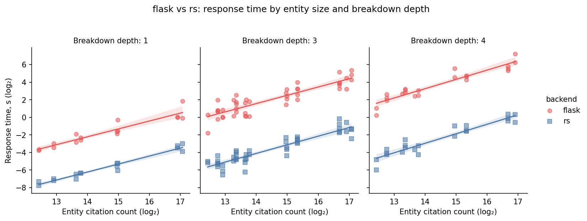
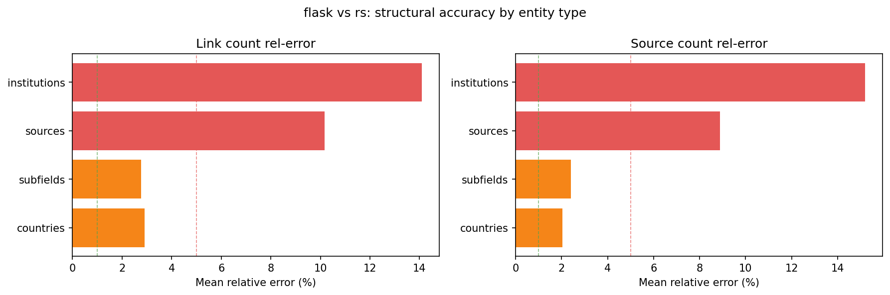
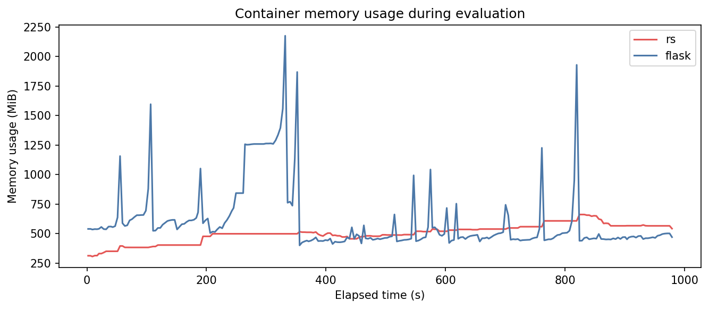

# SQL vs Rust Backend Comparison

This document reports the results of two comparative evaluations between the Flask/SQL reference backend and the Rankless Rust backend, run on data subsets. The full production dataset contains approximately **80 million works**; these subsets are used to validate correctness and measure performance at reduced scale.
The Rust binary's memory use reflects the full production server -- including its search engine, proactive cache, and features absent from the Flask baseline - that should be taken into account when comparing memory footprint.
Both comparisons issue identical tree queries against both backends simultaneously, running in restricted 10GB memory 4 cpu docker containers, and compare the results structurally. 

Metrics capture:

- **flask/rs** — time ratio (>1 means Flask is slower)
- **r(LC)** — Pearson correlation of link counts
- **r(SC)** — Pearson correlation of source counts
- **err(LC)** — relative error in link counts
- **err(SC)** — relative error in source counts
- **TopID%** — fraction of queries where the top source entity matched by ID
- **TopLnkErr** — relative error in the top source's link count

The speed advantage (~60-64×) is consistent across both subset sizes. Accuracy metrics improve slightly with larger subsets, as the proportion of entities with incomplete citation data decreases. Both subsets are far smaller than the full 80M-work dataset, where absolute citation counts are more complete and the structural agreement between backends is expected to be higher.

The primary source of divergence in both runs is query configurations involving `sources-T` (journal-level citation breakdown), which shows lower Pearson correlations (0.5–0.8) and higher relative errors. This reflects a filter in the Rust dataset, that would have added more complexity to the postgres reproduction.

## Cross-subset comparison

| Metric | Micro (200k works) | Mini (800k works) |
|--------|--------------------|-------------------|
| Comparisons | 82 | 744 |
| Speed ratio | 60.87× | 63.75× |
| Mean Pearson LC | 0.9351 | 0.9206 |
| Mean Pearson SC | 0.9455 | 0.9435 |
| Mean rel-error LC | 7.78% | 6.57% |
| Mean rel-error SC | 7.76% | 5.62% |
| Top-source ID match | 75.6% | 81.2% |
| Rust peak memory | 662 MiB | 1150 MiB |
| Flask peak memory | 2176 MiB | 4359 MiB |

---

## Mini-Subset (800k works)

Run timestamp: `2026-03-09 22:38` | 744 comparisons across 32 query configurations.

### Summary

| Metric | Value |
|--------|-------|
| Comparisons | 744 |
| Errors | 0 |
| Total time (Flask) | 4887.8s |
| Total time (Rust) | 76.7s |
| **Speed ratio (Flask/Rust)** | **63.75×** |
| Mean Pearson — link count | 0.9206 |
| Mean Pearson — source count | 0.9435 |
| Mean rel-error — link count | 6.57% |
| Mean rel-error — source count | 5.62% |
| Top-source ID match rate | 81.2% |
| Top-source link rel-error | 6.49% |

### Memory Usage

| Metric | Rust | Flask |
|--------|------|-------|
| Peak (MiB) | 1150 | 4359 |
| Mean (MiB) | 950 | 1007 |

### By root type × breakdown

| Root | Breakdown | N | Flask/Rust | r(LC) | r(SC) | err(LC) | err(SC) | TopID% | TopLnkErr |
| --- | --- | --- | --- | --- | --- | --- | --- | --- | --- |
| authors | subfields-S;works-S;countries-T;institutions-T | 12 | 32.25× | 1.000 | 1.000 | 0.03% | 0.01% | 100% | 0.03% |
| authors | sources-S;works-S;countries-T;institutions-T | 12 | 68.92× | 0.737 | 0.748 | 0.06% | 0.03% | 100% | 0.05% |
| authors | authors-S;works-S;subfields-T | 12 | 21.14× | 0.998 | 0.999 | 0.09% | 0.04% | 100% | 0.06% |
| sources | countries-S;institutions-S;subfields-S | 29 | 42.95× | 1.000 | 1.000 | 0.29% | 0.12% | 98% | 0.22% |
| countries | institutions-S;subfields-S;countries-T;institutions-T | 23 | 53.31× | 0.998 | 1.000 | 0.46% | 0.32% | 86% | 0.27% |
| institutions | subfields-S;countries-T;institutions-T;subfields-T | 28 | 41.75× | 1.000 | 1.000 | 0.47% | 0.41% | 80% | 0.18% |
| countries | subfields-T | 23 | 19.54× | 0.999 | 1.000 | 0.87% | 0.53% | 96% | 2.45% |
| institutions | subfields-S;subfields-T;topics-T | 28 | 37.24× | 1.000 | 1.000 | 0.67% | 0.57% | 84% | 0.34% |
| institutions | countries-T;institutions-T;subfields-T;topics-T | 28 | 68.26× | 1.000 | 1.000 | 0.66% | 0.60% | 72% | 0.20% |
| subfields | topics-S;countries-S;institutions-S | 35 | 69.50× | 1.000 | 1.000 | 0.90% | 0.61% | 96% | 0.58% |
| countries | subfields-S | 23 | 20.54× | 0.999 | 1.000 | 1.06% | 0.65% | 96% | 2.26% |
| institutions | countries-S;subfields-S;institutions-S | 28 | 62.43× | 0.987 | 0.988 | 1.50% | 0.70% | 97% | 1.38% |
| countries | countries-T;subfields-T;institutions-T | 23 | 36.59× | 1.000 | 1.000 | 0.90% | 0.76% | 68% | 0.50% |
| subfields | countries-T;subfields-T;topics-T | 35 | 114.83× | 1.000 | 1.000 | 0.84% | 0.80% | 65% | 0.23% |
| subfields | countries-S | 35 | 57.45× | 1.000 | 1.000 | 0.90% | 0.93% | 97% | 0.54% |
| subfields | subfields-T | 35 | 15.96× | 1.000 | 1.000 | 1.12% | 1.08% | 95% | 0.58% |
| authors | subfields-S;countries-T;institutions-T;subfields-T | 12 | 38.58× | 1.000 | 1.000 | 1.12% | 1.12% | 80% | 0.20% |
| countries | countries-S;institutions-S;subfields-S | 23 | 18.81× | 0.999 | 1.000 | 8.27% | 1.27% | 77% | 22.36% |
| authors | countries-T;institutions-T;subfields-T;topics-T | 12 | 76.57× | 1.000 | 1.000 | 1.48% | 1.49% | 68% | 0.15% |
| authors | countries-T;subfields-T;topics-T | 12 | 105.82× | 1.000 | 1.000 | 1.63% | 1.64% | 69% | 0.23% |
| authors | subfields-S;subfields-T;topics-T | 12 | 28.35× | 1.000 | 1.000 | 1.93% | 1.95% | 85% | 0.56% |
| authors | subfields-T | 12 | 12.77× | 1.000 | 1.000 | 2.73% | 2.69% | 91% | 0.11% |
| authors | authors-S;countries-T;institutions-T | 12 | 64.68× | 0.998 | 0.997 | 3.05% | 3.15% | 83% | 0.54% |
| sources | subfields-S;countries-T;institutions-T;sources-T | 29 | 72.30× | 0.956 | 0.920 | 5.50% | 4.60% | 79% | 3.43% |
| institutions | subfields-S;countries-T;institutions-T;sources-T | 28 | 81.21× | 0.953 | 0.924 | 6.30% | 5.14% | 78% | 3.77% |
| authors | sources-S;subfields-S;countries-T | 12 | 68.28× | 0.716 | 0.707 | 5.45% | 5.21% | 90% | 3.34% |
| institutions | subfields-T;sources-T;topics-T | 28 | 42.05× | 0.800 | 0.855 | 7.98% | 6.65% | 64% | 5.74% |
| countries | institutions-S;sources-S;subfields-S;countries-T | 23 | 172.25× | 0.845 | 0.870 | 9.19% | 8.72% | 91% | 4.65% |
| sources | sources-T;countries-T;subfields-T | 29 | 68.30× | 0.537 | 0.775 | 9.80% | 9.01% | 59% | 6.07% |
| subfields | sources-S;countries-S;institutions-S | 35 | 117.03× | 0.656 | 0.834 | 10.48% | 9.34% | 92% | 6.58% |
| institutions | sources-T;countries-T;subfields-T | 28 | 72.82× | 0.653 | 0.793 | 12.29% | 11.02% | 62% | 7.24% |
| institutions | authors-S;countries-T;institutions-T | 28 | 41.37× | 0.820 | 0.806 | 86.30% | 76.53% | 28% | 104.01% |

### Plots

**Response timing:**

**Structural accuracy (Pearson correlations and relative errors):**

**Memory usage over time:**

---

## Micro-Subset (200k works)

Run timestamp: `2026-03-09 19:10` | 82 comparisons across 22 query configurations.

### Summary

| Metric | Value |
|--------|-------|
| Comparisons | 82 |
| Errors | 0 |
| Total time (Flask) | 913.6s |
| Total time (Rust) | 15.0s |
| **Speed ratio (Flask/Rust)** | **60.87×** |
| Mean Pearson — link count | 0.9351 |
| Mean Pearson — source count | 0.9455 |
| Mean rel-error — link count | 7.78% |
| Mean rel-error — source count | 7.76% |
| Top-source ID match rate | 75.6% |
| Top-source link rel-error | 8.15% |

### Memory Usage

| Metric | Rust | Flask |
|--------|------|-------|
| Peak (MiB) | 662 | 2176 |
| Mean (MiB) | 502 | 609 |

### By root type × breakdown

| Root | Breakdown | N | Flask/Rust | r(LC) | r(SC) | err(LC) | err(SC) | TopID% | TopLnkErr |
| --- | --- | --- | --- | --- | --- | --- | --- | --- | --- |
| institutions | subfields-S;countries-T;institutions-T;subfields-T | 4 | 34.16× | 1.000 | 1.000 | 0.21% | 0.19% | 73% | 0.06% |
| institutions | countries-T;institutions-T;subfields-T;topics-T | 4 | 59.38× | 1.000 | 1.000 | 0.24% | 0.23% | 61% | 0.04% |
| sources | countries-S;institutions-S;subfields-S | 2 | 31.46× | 1.000 | 1.000 | 0.56% | 0.25% | 97% | 0.43% |
| countries | institutions-S;subfields-S;countries-T;institutions-T | 4 | 55.43× | 0.999 | 1.000 | 0.41% | 0.29% | 83% | 0.24% |
| institutions | subfields-S;subfields-T;topics-T | 4 | 31.19× | 1.000 | 1.000 | 0.32% | 0.32% | 78% | 0.12% |
| institutions | countries-S;subfields-S;institutions-S | 4 | 53.62× | 0.993 | 0.995 | 0.77% | 0.43% | 97% | 0.68% |
| countries | subfields-T | 4 | 10.69× | 1.000 | 1.000 | 0.83% | 0.58% | 95% | 1.50% |
| countries | countries-T;subfields-T;institutions-T | 4 | 34.28× | 1.000 | 1.000 | 0.75% | 0.64% | 64% | 0.34% |
| subfields | topics-S;countries-S;institutions-S | 4 | 50.34× | 1.000 | 1.000 | 1.27% | 0.65% | 96% | 0.94% |
| subfields | countries-T;subfields-T;topics-T | 4 | 101.44× | 1.000 | 1.000 | 0.70% | 0.68% | 63% | 0.16% |
| countries | subfields-S | 4 | 11.95× | 0.999 | 1.000 | 0.94% | 0.68% | 94% | 1.22% |
| subfields | subfields-T | 4 | 8.90× | 1.000 | 1.000 | 0.89% | 0.84% | 97% | 0.07% |
| subfields | countries-S | 4 | 48.60× | 1.000 | 1.000 | 1.19% | 0.90% | 86% | 3.60% |
| countries | countries-S;institutions-S;subfields-S | 4 | 24.43× | 1.000 | 1.000 | 5.44% | 0.98% | 80% | 13.91% |
| institutions | subfields-S;countries-T;institutions-T;sources-T | 4 | 79.28× | 0.906 | 0.913 | 6.91% | 5.90% | 69% | 4.11% |
| institutions | subfields-T;sources-T;topics-T | 4 | 36.67× | 0.780 | 0.834 | 9.01% | 7.77% | 49% | 6.54% |
| subfields | sources-S;countries-S;institutions-S | 4 | 137.90× | 0.641 | 0.771 | 9.82% | 8.96% | 93% | 6.21% |
| sources | subfields-S;countries-T;institutions-T;sources-T | 2 | 83.05× | 0.943 | 0.933 | 10.90% | 8.97% | 77% | 6.37% |
| countries | institutions-S;sources-S;subfields-S;countries-T | 4 | 212.07× | 0.823 | 0.830 | 9.15% | 8.98% | 90% | 4.40% |
| institutions | sources-T;countries-T;subfields-T | 4 | 68.46× | 0.794 | 0.838 | 15.45% | 14.16% | 48% | 9.26% |
| sources | sources-T;countries-T;subfields-T | 2 | 82.70× | 0.763 | 0.782 | 19.03% | 17.44% | 53% | 11.33% |
| institutions | authors-S;countries-T;institutions-T | 4 | 24.20× | 0.883 | 0.843 | 79.90% | 92.59% | 20% | 104.56% |

> As with the mini-subset, the `institutions / authors-S` configuration shows inflated errors due to the high fraction of missing author records in small subsets.

### Plots

**Response timing:**

**Structural accuracy (Pearson correlations and relative errors):**

**Memory usage over time:**

## 2nd round of SQL Comparison Robustness checks

### 2026-03-18 — Primary benchmark (used in paper)

792 queries across 5 entity types (authors, institutions, countries, sources, subfields) and 32 breakdown configurations with 1–4 hierarchy levels.

Slightly larger mini set: 224k papers, 783k citations

| Metric | PostgreSQL + Flask | Rankless (Rust) | Ratio |
|--------|-------------------|-----------------|-------|
| Total query time | 6,402.3 s | 98.0 s | 65.3× |
| Peak memory | 4,222 MiB | 1,225 MiB | 3.4× |
| Mean memory | 1,069 MiB | 1,026 MiB | 1.0× |

**Correctness:** 20/32 configurations achieve Pearson r > 0.99 with relative error < 2% on source counts. Remaining configs involve source-level cross-entity aggregation paths where the two systems' aggregation strategies diverge (overall mean relative error ~5%).

**Per-query average:** ~124 ms (Rust) vs ~8.1 s (Flask).

### 2026-03-19 — Validation run

503 queries, subset of configurations. Confirms the architectural gap holds across runs.

Slightly larger micro set: 224k papers, 783k citations

| Metric | PostgreSQL + Flask | Rankless (Rust) | Ratio |
|--------|-------------------|-----------------|-------|
| Total query time | 2,622.9 s | 47.1 s | 55.7× |
| Peak memory | 4,857 MiB | 815 MiB | 6.0× |

Lower speedup ratio reflects a different configuration mix (fewer deep-hierarchy queries). Higher memory ratio reflects lighter Rust cache load.

